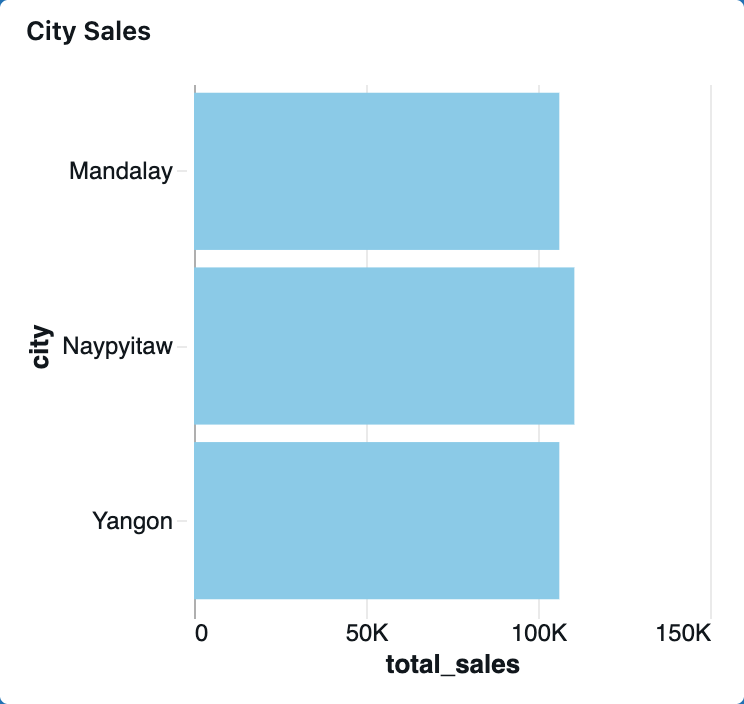
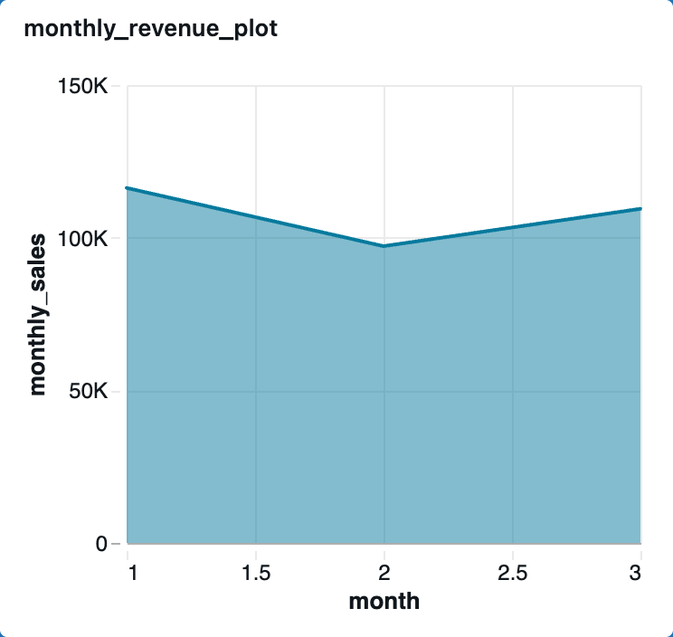
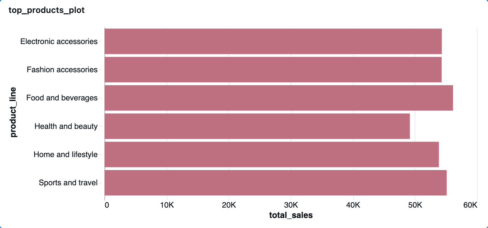

# retail-sales-databricks-platform
This project demonstrates a modern data platform built using Databricks and PySpark following the Medallion Architecture pattern.

# Data Quality Checks

Implemented:

- Null value validation
- Duplicate detection
- Schema inspection
- Basic business rule validation

# Dashboard Examples

## Sales by City



## Monthly Revenue




## Top Products




# Key Learnings

- Built distributed ETL pipelines using PySpark
- Implemented Medallion Architecture in Databricks
- Managed Delta Lake tables
- Performed data quality validation
- Created analytics-ready datasets for BI reporting


# Project Structure

```text
retail-sales-databricks-platform/
│
├── notebooks/
├── sql/
├── screenshots/
└── README.md
```
